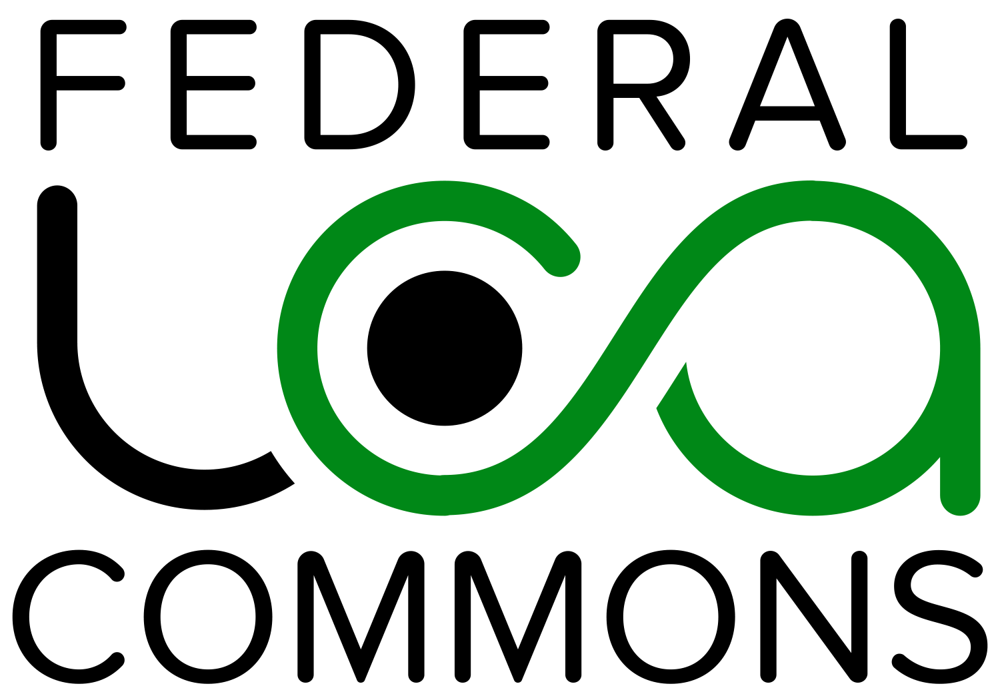

# Federal LCA Commons (FLCAC) Documentation 

  <picture>
    <source media="(prefers-color-scheme: dark)" srcset="docs/img/lca_logo_invert.png">
    <source media="(prefers-color-scheme: light)" srcset="docs/img/lca_logo.png">
  </picture>

<!-- [FLCAC Website] | [Getting started] | [Learn] | [Reference] -->

<!-- [FLCAC Website]: https://lcacommons.gov -->
<!-- [Getting Started]: https:// -->
<!-- [Learn]: https:// -->
<!-- [Reference]: https:// -->

🚧 **This site is under construction. New content will continue to be added** 🚧

Welcome to the [FLCAC](https://lcacommons.gov) documentation and support repository. 

This repo hosts the [MyST Markdown](https://mystmd.org/) files from which the documentation site is rendered.

[**Click here to view the documentation site.**]()

## Have Questions?
- First, please refer to the [Frequently Asked Questions](FAQ.md) page.
- Have a terminology question? Check out the list of [common terms and acronyms](CommonTermAcronyms.md). 
- The [Other Resources](OtherResources.md) page can also help direct you to useful resources. 
- If the above resources fail to answer your question, consider opening a new issue or contributing to a discussion thread.

## Using Issues and Discussions

### Confirm the Novelty of Your Issue or Discussion
Before opening a new issue or discussion on an FLCAC repo, please first confirm that your concern hasn't already been raised or addressed. Review the lists of issues—both open and closed (e.g., [this repo's issues](https://github.com/FLCAC-admin/FLCAC-Curation/issues?q=))—and [discussions](https://github.com/FLCAC-admin/FLCAC-Curation/discussions) across the subset of FLCAC repos relevant to your issue:

 Topic | Repository
 --- | ---
 Federal Elementary Flow List | [fedelemflowlist](https://github.com/USEPA/fedelemflowlist)
 LCIA methods on the FLCAC | [LCIA formatter](https://github.com/USEPA/LCIAformatter)
 USLCI | [USLCI-content](https://github.com/FLCAC-admin/uslci-content)
 Anything else | [FLCAC-Curation](https://github.com/FLCAC-admin/FLCAC-Curation)

### Issues
Issues are generally intended to report bugs and request enhancements related to the topic of that GitHub repository. 
It is helpful if issues have a clear path towards resolution.

- Please [apply labels](https://docs.github.com/en/issues/using-labels-and-milestones-to-track-work/managing-labels#applying-a-label) to issues to help keep them organized. The list of labels available in each repository can be viewed via the Labels button on the Issues tab (e.g., [FLCAC-Curation labels](https://github.com/FLCAC-admin/FLCAC-Curation/labels)).
- Examples of content ideal for issues:
    - Did you find an incorrect flow mapping or conversion factor in the [All Mappings](https://dmap-data-commons-ord.s3.amazonaws.com/fedelemflowlist/All_Mappings.xlsx) file? 
    Post an issue here: [fedelemflowlist](https://github.com/USEPA/fedelemflowlist)
    - Suggest a [targeted enhancement to the FEDEFL](https://github.com/USEPA/fedelemflowlist/issues/137).

### Discussions
For topics with a wider scope or where more discussion may be required to reach a resolution, please post it as a discussion topic. 

Please apply labels to help keep the discussion list organized. 
Discussions rely on the same set of repository-specific labels used by Issues (e.g., [FLCAC-Curation labels](https://github.com/FLCAC-admin/FLCAC-Curation/labels)).

## Contributing to FLCAC GitHub Repositories

We appreciate your interest in adding to shared resources for the LCA community!

To contribute content to a repository, please [fork](https://docs.github.com/en/pull-requests/collaborating-with-pull-requests/working-with-forks/about-forks) it, commit your edits, then [open a pull request](https://docs.github.com/en/pull-requests/collaborating-with-pull-requests/proposing-changes-to-your-work-with-pull-requests/creating-a-pull-request-from-a-fork) with a clear description of your work.

The easiest places to contribute to the `FLCAC-Curation` repository include adding to the [Frequently Asked Questions](FAQ.md), list of [common terms and acronyms](CommonTermAcronyms.md), or  [Other Resources](OtherResources.md). 

The FLCAC Data Curation team is actively reorganizing existing resources and updating guidance to make sure it is clear and accessible. Feedback on these efforts is always appreciated. Thank you!

## Contact Information
If the resources above fail to answer your question, please contact us at FederalLCACommons@erg.com.

For questions specific to USLCI, you can send your questions to USLCI@erg.com.
