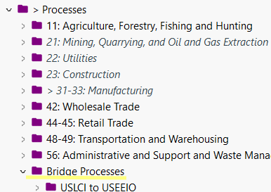

## What is a bridge process?
Data on the Federal LCA Commons is spread out across different repositories. Sometimes a life cycle inventory in one repository will need to reference a technosphere flow and upstream process (provider) in another repository. These references can be direct replacements or they may require conversions and/or provider selections. Bridge processes are designed to provide transparent connections between repositories. Where an exchange uses a technosphere flow generated by a process in another repository and a conversion or provider selection is needed a bridge process is used.

## What if a flow in another repository is referenced but a conversion or provider selection is not needed?
In this case the flow is directly imported and tagged with the name of the source repository. Once the user imports the necessary repository into an openLCA database, the flow will automatically connect to the correct provider and no additional steps are needed from the data user.

## How to know if a repository requires the import of another repository?
The description under each repository on [lcacommons.gov](lcacommons.gov) states which repositories should be imported with the repository of interest.

## How to import another repository into your openLCA database?
Follow the same steps used to import the initial repository into your openLCA database. More details can be found on the [Accessing Data page](https://flcac-admin.github.io/FLCAC-docs/accessing-data).

## How to connect the correct providers to bridge processes?
1. Select the Bridge Processes folder.

    

2. Open each bridge process to determine if a provider selection is required. The description field on the general information tab will state if a provider needs to be selected. Many bridge processes just include conversions, especially those connected to USEEIO, so a provider does not need to be selected. 

Example of a bridge process that *does not* need a provider selection -
    

Example of a bridge process that *does* need a provider selection -
    
