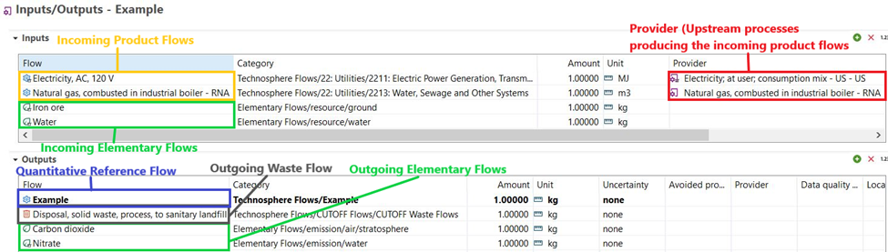

This is the Federal LCA Commons (FLCAC) Data Submission Handbook. It describes the data submission and documentation framework that all new data across the FLCAC repositories must adhere to. Resources for data providers are provided within this handbook.

- [The Data Submission Toolkit](https://flcac-admin.github.io/FLCAC-docs/datasubmissiontoolkit) provides an overview of the data submission and formatting steps that are provided in this handbook.
<!-- - [The Data User Handbook can be found here](https://flcac-admin.github.io/FLCAC-docs/datauserhandbook). -->
- [The FLCAC Repository Management Handbook can be found here](https://flcac-admin.github.io/FLCAC-docs/repositorymanagementhandbook).

# Introduction

The [FLCAC platform](https://www.lcacommons.gov/) provides users access to your data in LCA data formats and permits connectivity between your data and other LCA data resources.

The National Renewable Energy Lab (NREL) FLCAC Data Curators developed this comprehensive handbook to communicate the FLCAC’s streamlined, transparent, data provider-oriented submission and publication workflow. It additionally provides guidance for using the openLCA software within the context of preparing data for FLCAC submission.

The FLCAC data curation process is collaborative and iterative. The FLCAC Curators will review datasets to verify their compliance with the FLCAC Submission Handbook Guidelines, and coordinate with data providers to reconcile outstanding issues. Throughout this resource, additional opportunities for support from the FLCAC Data Curators during dataset preparation processes are clearly communicated.

The FLCAC consists of multiple, distinct LCI repositories covering a variety of topics, and compatible LCIA methods. One of the FLCAC repositories is the U.S. Life Cycle Inventory database (USLCI) which is managed by NREL and covers a wide breadth of LCI data from industry and researchers. Federal agencies or their laboratories independently manage these repositories. A list of repositories and their management’s contact information can be found [here](https://flcac-admin.github.io/FLCAC-docs/flcac-repositories).

The FLCAC Data Submission Handbook applies to all repositories on the FLCAC. This is a living document and will be updated as the FLCAC data submission process evolves. **This handbook applies to all new data submissions but is not enforced retroactively.**

The objectives of this handbook are to:

- Help data providers decide if their data is a good fit for the FLCAC via the [Benefits](#benefits), [Expectations](#expectations), [Placing Your Data in the Public Domain](#placing-your-data-in-the-public-domain), and [Working with the Data Curator](#working-with-the-data-curator) sections.

- Guide data providers through the [Data Curation](#data-curation) steps, including the [Data Formatting](#data-formatting) stage to prepare their LCI data for submission.

If you have any questions, concerns, or recommendations, please contact us at: FederalLCACommons@erg.com.

# Benefits

- The FLCAC repositories offer data providers with the opportunity to share complete, representative, and well-documented LCI data to a public repository.
- The FLCAC provides public, interoperable repositories that can be used separately or together to form complete product systems.
- The FLCAC gives users across the value chain access to transparent and representative LCI data alongside guidance for its intended use.

# Expectations

- The dataset should have a comprehensive LCI
- LCI data should represent a novel or enhancing contribution to the FLCAC
- LCI data should be non-proprietary (i.e., no ecoinvent processes)
- Data providers accept that their data will be publicly available if submitted to the FLCAC[^Public]
- Data should undergo a review before submission to the FLCAC
- Data should principally represent the US/North American geographical region[^Geography]
- Data providers will strive to submit unit processes in place of system processes[^System]
- Multifunctional unit processes should include all co-products and any associated allocation factors or displaced products[^Allocation]
- If multiple, gate-to-gate unit processes for a product system are submitted, the linking between them should be explicit.
- Flow data within a unit process must be based on measurements using a specified and standardized measurement method OR estimated using methods and data described in specified in a publicly available source.

[^Public]: Please review the [Placing Your Data in the Public Domain](#placing-your-data-in-the-public-domain) section.
[^Geography]: If data are outside of this geographic scope, inquire with the FLCAC Curators on their appropriateness of inclusion to the FLCAC
[^System]: System processes will only be accepted when data aggregation (e.g., horizontal averaging, vertical aggregation; proprietary, ease-of-use) is required from the data provider. See metadata guidance for instructions on documenting aggregation method.
[^Allocation]: The allocation approach should be justified and clearly described in the metadata.

---
% block for footnotes

# Placing Your Data in the Public Domain
To support increased access to and sharing of resources, as well as to promote novel and innovative uses of LCA data, NREL requires that all datasets submitted to the LCA Commons be placed in the public domain under the terms of the [Creative Commons Legal Code (CC0 1.0 Universal (CC0 1.0))]( https://github.com/FLCAC-admin/uslci-content/blob/dev/docs/submission_handbook/04-resources/04-App-C.md). By placing your datasets in the public domain, according to the CC0 1.0 license, you are removing “all of [your] rights to the work worldwide under copyright law, including all related and neighboring rights, to the extent allowed by law.” 

For USLCI data submissions, please review the legal code of the CC0 1.0 Universal license before submitting your datasets, as well as the [Data Use Disclaimer Agreement]( https://github.com/FLCAC-admin/uslci-content/blob/dev/docs/submission_handbook/04-resources/04-App-A.md) and [Data Provider’s Content License Agreement]( https://github.com/FLCAC-admin/uslci-content/blob/dev/docs/submission_handbook/04-resources/04-App-B.md).

# Data Formatting Overview
To facilitate compliance with ISO 14048:2002, the FLCAC uses the [openLCA database schema](https://greendelta.github.io/olca-schema/) and builds upon this schema with additional requirements to standardize data across FLCAC repositories. There are five steps of data formatting to align data with the openLCA and FLCAC schemas:

1. Technosphere flow alignment with FLCAC product, waste, or cut-off flows
2. Elementary flow alignment with the Federal Elementary Flow List (FEDEFL)
3. Categorization of processes and flows using the North American Industry Classification System (NAICS)
4. Run LCIA results with new FEDEFL/FLCAC aligned model and compare to the original LCIA results
5. Metadata conformance with the openLCA schema and metadata guidance provided in this handbook (includes data quality measurements)

Detailed information about these steps is provided in the [Data Formatting section](#data-formatting).

:::{note}
To minimize data formatting efforts and ensure all metadata elements persist throughout submission, datasets submitted to the FLCAC should be edited in openLCA or in a format that is compatible with the latest version of openLCA. Editing guidance is provided in Section 2 of this handbook. 

EcoSpold (v1 and v2) and International Reference Life Cycle Data (ILCD) submissions generated by SimaPro, GaBi, ecoEditor, the ILCD editor, or any other editor may not support the required format and metadata fields, so datasets will need to be edited according to the guidelines provided in Section 2.
:::

# Working with the Data Curator
The data publication process is a collaborative effort between you (i.e., the Data Provider) and the Data Curator. Practically speaking, that means you will be working closely with one of NREL's LCI Data Curators throughout the publication process.

The Data Curator's role is to guide you through the publication process. This person is trained in LCI data curation and can help you troubleshoot technical issues related to exporting and/or importing LCI data formats, completing dataset metadata fields, and using the openLCA platform.

Your role in the publication process is to transform your raw LCI data into a product that is ready for publication on the FLCAC. ‘Transform’ means to put your data into the FLCAC/openLCA data format and pair your data with robust metadata so that data users understand how to properly interpret and apply your data.

The documentation, metadata guidance, and resources in this Data Submission Guide will be essential resources in the submission process.

# Data Curation
NREL uses a Digital Curation Process for receiving, formatting, reviewing, and publishing data and metadata submitted to the FLCAC. The process is divided into five phases:

1. [Appraisal](#appraisal)
2. [Data Import](#data-import-into-openlca)
3. [Data Formatting](#data-formatting)
4. [Review](#review)
5. [Publication and Preservation](#publication)

Each of the five phases are discussed in detail below but a quick overview of the entire procedure for submitting data to the FLCAC is as follows:

- Become familiar with the [Federal LCA Commons platform](https://www.lcacommons.gov/)
-	[Appraisal](#appraisal): 
    - Contact the FLCAC Data Curator to set up an initial appraisal meeting to discuss your datasets intended for submission to the FLCAC
    -	Prior to this meeting fill out the [Data Submission Questionnaire](https://flcac-admin.github.io/FLCAC-docs/datasubmissiontoolkit#data-provider-questionnaire) and submit it to the Data Curator at FederalLCACommons@erg.com
    - During this meeting we will discuss the specific steps needed to prepare your data for submission and assign roles
-	[Data Import into openLCA](#data-import-into-openlca):
    -	Download the [openLCA software](https://www.openlca.org/download/) and install it on your computer
    -	[Import data into openLCA](https://greendelta.github.io/openLCA2-manual/databases/importing_and_combining_databases.html?highlight=import#importing-data) or [manually enter data](https://greendelta.github.io/openLCA2-manual/processes/creating_new_process.html)
-	[Data Formatting](#data-formatting): 
    - Prepare and format your unit processes/product system as discussed in the initial curation meeting and the [Data Formatting section](#data-formatting)
    - Export ONLY your prepared datasets as a zipped JSON-LD file & submit to the Data Curator or [add the datasets to a repository directly through the collaboration server](https://flcac-admin.github.io/FLCAC-docs/accessing-data#connecting-a-database-directly-to-the-flcac-collaboration-server)
-	[Review](#review):
    - Reconcile issues identified by the Data Curator during the review process & check results
    -	Approve the final version
- [Publication and Preservation](#publication-and-preservation):
  -	FLCAC Data Curator will publish your dataset(s) on the FLCAC and preserve the final version(s)

:::{tip} Additional Resources

- [Useful resources for data submission can be found in this section](#resources)
- Frequently Asked Questions regarding the data submission process can be found [here](https://flcac-admin.github.io/FLCAC-docs/faq#data-submission)
- A YouTube video detailing the data submission process can be found [here](https://www.youtube.com/watch?v=IlPlYet8llY&list=PLmIn8Hncs7bFUOyXZNGXwG4LtdoTfLz6Q&index=9&)
:::

## Appraisal
**Appraisal Objectives**

The objectives of the Appraisal phase are to:

- Verify the fitness of your data for publication on the FLCAC
- If appropriate, develop a plan for the Data Formatting phases of the Curation Process.

**Appraisal Steps**

The Appraisal phase is composed of the following elements:

1. Complete the Data Submission Questionnaire
2. Submit the Data Submission Questionnaire and original LCI data to the Data Curator
3. Preliminary data review by the Data Curator
4. (If appropriate) An Appraisal Meeting

The Appraisal phase begins by submitting your data and the Data Submission Questionnaire to the Data Curator for preliminary review. EcoSpold (v1 and v2) and ILCD submissions generated by SimaPro, GaBi, ecoEditor, the ILCD editor, or any other editor are sufficient for the Appraisal phase. However, these file formats may not support required flows or metadata fields. For this reason, the Data Formatting phase will guide you to reproduce your datasets in the required file format.

Following this review, a 30-60 minute Appraisal Meeting may be scheduled. This meeting is an opportunity to evaluate the data at a deeper level and develop a plan for the Data Formatting and Review phases of the Curation Process. The Appraisal Meeting results in one of two outcomes:
1. Data approved and data curation plan is established
2. Revise and resubmit

**Data Transfer Platform**

During the initial Appraisal Meeting the Data Curator and Data Provider will discuss platforms for data transfer. openLCA databases can be too large to send via email. For most Data Providers, a private GitHub repository is set-up to transfer files back and forth during the appraisal and review phases. Other potential options include the FLCAC collaboration server, email, or an FTP site.

## Data Import into openLCA
All data on the FLCAC is compatible and intended to be used with [openLCA](https://www.openlca.org/), an open-source, free LCA software that can import data from many commercial LCA software applications including GaBi and SimaPro. Most data formatting will take place inside of openLCA so the Data Provider will need to [download the latest version of openLCA](https://www.openlca.org/download/). 

To import a dataset that exists in a format that is compatible with openLCA, please review [these instructions from the openLCA manual](https://greendelta.github.io/openLCA2-manual/databases/importing_and_combining_databases.html). Data formats that can be directly imported into openLCA include:

- EcoSpold 1
- ILCD
- Excel (must be an openLCA compatible excel format)
- SimaPro CSV
- Zolca (openLCA specific format)
- JSON-LD

Create an empty database to import data into.

Reference the [Accessing FLCAC Data](https://flcac-admin.github.io/FLCAC-docs/accessing-data) page for more information on accessing data on the FLCAC and connecting databases to the FLCAC Collaboration Server and/or a GitHub repository.

If data does not exist in a format that can be imported into openLCA then data should be entered manually or for bulk and large datasets an automated data entry method will be discussed in the initial Appraisal meeting. Bulk data entry methods vary based on the source format of the original data.

## Data Formatting
### Data Formatting Overview
To facilitate compliance with ISO 14048:2002, the FLCAC uses the [openLCA database schema](https://greendelta.github.io/olca-schema/) and builds upon this schema with additional requirements to standardize data across FLCAC repositories. There are five steps of data formatting to align data with the openLCA and FLCAC schemas:

The Data Formatting phase provides steps for preparing your data for submission to the FLCAC. There are five stages of data formatting, each of which are described in detail in this section:

1.	Technosphere flow alignment with FLCAC product, waste, or cut-off flows[^flows]
2.	Elementary flow alignment with the Federal Elementary Flow List (FEDEFL)[^flows]
3. Categorization of processes and flows using the North American Industry Classification System (NAICS)
4. Run LCIA results with new FEDEFL/FLCAC aligned model and compare to the original LCIA results
5.	Metadata conformance with the openLCA schema and metadata guidance provided in this handbook (includes data quality measurements)

[^flows]: To keep FLCAC repositories interoperable and self-contained both technosphere and elementary flows need to be aligned with the guidelines below.

:::{note}
To minimize data formatting efforts and ensure all metadata elements persist throughout submission, datasets submitted to the LCA Commons should be edited in openLCA or in a format that is compatible with the latest version of openLCA.

EcoSpold (v1 and v2) and International Reference Life Cycle Data (ILCD) submissions generated by SimaPro, GaBi, ecoEditor, the ILCD editor, or any other editor may not support the required format and metadata fields, so datasets will need to be edited according to the guidelines provided in this document.
:::

**Please review [The Basics for openLCA section of the openLCA manual](https://greendelta.github.io/openLCA2-manual/running_olca_for_first_time.html) prior to beginning these formatting steps.**

Please also review these notes on flows and processes before beginning data formatting:
-	There are two main types of flows in LCA:
    1.	Technosphere flows which can be either:
        - Product flows
        - Waste flows
    2.	Elementary flows
-	Waste and product technosphere flows can take on three forms: 
    -	Intermediate flow: A flow that is produced by another process, not the foreground process. This flow needs to be linked to an upstream process via the ‘Provider’ field in openLCA.
    -	Cut-off flow: A flow that does not have an upstream process producing it. A Cut-off flow can also be referred to as a ‘Dummy’, ‘Proxy’, ‘Surrogate’, or ‘Placeholder’ flow. These flows are used when no relevant flows in a database exists. It is not recommended to use these flows in your life cycle inventory if possible.
    -	Quantitative reference flow:  The quantitative reference is the main/desired output of the foreground process. 

-	A process in openLCA produces one quantitative reference technosphere flow and can produce multiple other technosphere flows if co-products or avoided products are also produced. 
-	One technosphere flow can be produced by multiple processes. So, in an LCI the desired upstream process producing a flow should be selected via the ‘Provider’ field.
    -	For example, a flow named “Electricity, at grid” could be produced by the following processes “Northeastern electricity grid mix”, “Southeastern electricity gird mix”, Northwestern electricity grid mix”, and “Southwestern electricity grid mix”. So when creating an LCI with the “Electricity, at grid” flow, the desired upstream gird mix process should be linked to the flow.

### Technosphere Flow Alignment
In openLCA, technosphere flows and processes are separate objects that can be linked via providers to form a product system.
Two types of technosphere flows exist within a process LCI in openLCA: waste flows and products flows. Waste and product flows can take on three forms:

1. Intermediate flow: A flow that is produced by another process, not the foreground process. This flow needs to be linked to an upstream process via the ‘Provider’ field in openLCA.
2. Cut-off flow: A flow that does not have an upstream process producing it. A Cut-off flow can also be referred to as a ‘Dummy’, ‘Proxy’, ‘Surrogate’, or ‘Placeholder’ flow. These flows are used when no relevant flows in a database exists. It is not recommended to use these flows in your life cycle inventory if possible.
3. Quantitative reference flow:  The quantitative reference is the main/desired output of the foreground process.

To keep FLCAC LCI data self-contained (i.e., not dependent on other LCI databases) all technosphere flows must already exist or be created within the FLCAC. For this reason, if the original LCI dataset relies on LCI databases outside of the FLCAC then intermediate and cut-off technosphere flows must be mapped to existing FLCAC flows/processes or new flows will need to be created within the FLCAC (e.g., an electricity flow from ecoinvent will need to be mapped to an electricity flow within the FLCAC repositories). The quantitative reference flow of a new process will need to be created or an existing flow can be selected as the quantitative reference flow of a new process.

#### Flow Mapping Technosphere Flows
To flow map intermediate and cut-off flow technosphere flows it is recommended to use openLCA’s flow mapping feature. 

1. In the openLCA database with your original data that needs to be mapped, import the repository that you intend to submit your data to from the [Federal LCA Commons platform](https://www.lcacommons.gov/lca-collaboration/) (e.g., USLCI).
    - Now your database should have your original technosphere flows and the FLCAC compatible technosphere flows of the repository that you’re submitting data to.
2. Follow the instruction in [Section 3 of this guidance document to create a new mapping file](https://www.openlca.org/wp-content/uploads/2020/06/General-openLCA-Mapping-Instructions_05182020.pdf).
    - The source and target database will be the same database (select the yellow disc symbol)
    - Map each flow in the foreground process that you intend to submit to a flow in the FLCAC repository that you are submitting data to.
    - Apply the mappings on the database and delete the old and unused flows

If there is not an appropriate technosphere flow to map to then follow these steps:

1. Evaluate if there are any proxy or surrogate flows in the FLCAC database that could be used (e.g., map lubricant to crude oil). Do not consider cut-off flows yet.
2. Search across all public FLCAC repositories via the [Federal LCA Commons platform](https://www.lcacommons.gov/lca-collaboration/) search feature. If an appropriate flow is found that is in a different repository, let the Data Curator know and we will combine repositories via the library feature. Do not consider cut-off flows yet.
3. If public, LCI data is available for the desired flow, consider adding another process to the FLCAC that fills in the data gap.
4. If no appropriate flow is found, then evaluate if there is an existing cut-off flow that is representative of your flow. Almost all peer reviewed LCI data is accepted as long as the original authors approve of its submission to the FLCAC.
5. If none of the above options are viable then create a new cut-off flow in the database and map your original flow to the new cut-off flow. Reference the cut-off section below for more details.

Once all technosphere flows have been mapped, delete any extraneous folders that may have housed upstream data that was just mapped. After technosphere flow mapping, your database should only have the Commons Core database NAICS folder structure and folders associated with elementary flows from your original data.

### Cut-off Flows
Cut-off flows are used to temporarily fill in data gaps in the FLCAC repositories. As new data is submitted, the Data Curator will replace cut-off flows when possible. 

A technosphere flow that is not being submitted as a dataset and is not already in any of the FLCAC repositories should be categorized in the Technosphere Flows>CUTOFF Flows folder with the description 'CUTOFF' in the product flow description metadata. Otherwise, a reasonable proxy from the FLCAC may be identified with a note in the ‘Input Flow, Description’ field regarding the flow database origin and original flow name. 

Processes from other databases should not be submitted as datasets. Datasets from different databases with disparate categorization schemes can prevent connectivity, cause duplications and/or confusion among users, and result in a bulky database when combining.

To limit the number of cut-off flows, please use existing cut-off flows if possible and reference the flow details (e.g., original database source and exact flow name) in the flow 'Description' field of the exchange which is located in the 'Input/Output' tab in openLCA. 

These outside database flow references will be submitted as 'Cut-offs' with reference to the source such that they may be re-integrated by end-users. This data set integration must occur locally by the Data Provider prior to submitting the sets to the FLCAC for curation. 

### Elementary Flow Alignment
Elementary flows are data components of LCA data that describe common physical items that move from the technosphere into nature or vice versa, these can be resources or emissions. They are used in exchanges in life cycle inventory (LCI) data to represent these movements into and out of processes, and they are used in Life Cycle Impact Assessment (LCIA) methods to match inventory data with impact characterization factors. Hence, they serve a critical role in LCA modeling and are essential in achieving LCA data interoperability. 

The US EPA has developed the EPA Federal LCA Commons Elementary Flow List (FEDEFL) which is a master elementary flow list that is available in CSV and openLCA schema JSON-LD formats. The current release version of FEDEFL is available via the [FLCAC platform](https://www.lcacommons.gov/lca-collaboration/Federal_LCA_Commons/elementary_flow_list/datasets).

The FLCAC has adopted the EPA Federal LCA Commons Elementary Flow List (FEDEFL) for elementary flow classification. The classification of elementary flows employed by the FEDEFL allows for a systematic approach for managing elementary flows on the FLCAC. All elementary flows in LCI data on the FLCAC must be based off FEDEFL.

#### Flow Mapping Elementary Flows
Guidance on using and converting to this nomenclature can be found on the [FEDEFL GitHub repository wiki page](https://github.com/USEPA/fedelemflowlist/wiki) or the [FEDEFL guidance document](https://cfpub.epa.gov/si/si_public_record_report.cfm?Lab=NRMRL&dirEntryId=341199). The FEDEFL wiki provides guidance on converting an established flow list in a standard openLCA format to FEDEFL flows. Please see the US EPA report, [The Federal LCA Commons Elementary Flow List: Background, Approach, Description and Recommendations](https://cfpub.epa.gov/si/si_public_record_Report.cfm?dirEntryId=347251&Lab=NRMRL) for more information regarding the FEDEFL requirements and nomenclature.

When submitting data, the elementary flow names in the LCI must correspond directly to the elementary flow names used in the LCIA method. Usage of the FEDEFL protocol for both LCI and LCIA datasets on the FLCAC ensures interoperability between these different types of datasets and the original and FEDEFL names are documented during the curation process.

:::{important}
USLCI and most other LCI repositories on the FLCAC do not contain all of the flows contained within the [FEDEFL repository](https://www.lcacommons.gov/lca-collaboration/Federal_LCA_Commons/elementary_flow_list/datasets), they only contain FEDEFL flows that are used by processes in their respective repositories in order to reduce file sizes. FEDEFL flows that are not contained in a repository but need to be referenced in a new process can be imported into the repository.
:::

### NAICS Categorization
Technosphere flows and processes on the FLCAC are classified using the North American Industry Classification System (NAICS) 2 digit/4 digit classification scheme. The [FLCAC Commons Core Database](https://www.lcacommons.gov/lca-collaboration/Federal_LCA_Commons/Fed_Commons_core_database/datasets) contains the NAICS folder structure and can be imported into an openLCA database to align flows and processes.
Steps to assign proper categorization to new flows and processes:
1. Search your product or process on the [Census Bureau NAICS website](https://www.census.gov/naics/) and identify the proper four-digit NAICS code
2. In openLCA, import the Commons Core Database into the database with your data
3.	Drag and drop your processes and flows that you will be submitting into the correct NAICS folders in your openLCA database

### LCIA Results
Once all elementary and technosphere flows have been aligned with the guidelines above, it is important to run LCIA results on your new model in openLCA to ensure that results are similar to those in your original model. If results are not similar, differences must be understood and discussed in the metadata.

To run LCIA results on your model please follow [these instructions](Running_LCIA_results) in the Data User Handbook. It is recommended to compare the total results for LCIA categories included in your LCI and investigate the contribution analysis to understand differences.

Reasons why your new openLCA/FLCAC compatible results may be different from your original results:
- Different background datasets (e.g., different sources, different scopes, slightly different output)
- Use of cut-off or proxy flows when data gaps on the FLCAC exist
- Error in data entry

### Metadata Guidance
As FLCAC interagency coordination increases, the new standard for data formats and documentation is being advanced. To move toward interoperability and transparency, FLCAC harmonization of digital data access and preservation will increase collaboration potential and the reviewability of the LCA data exchange process. These efforts will significantly reduce not only data acquisition costs but also computer- and human-based misinterpretation errors, and thus, data misuse. As such, and to be more aligned with international protocols for all newly developed data, the current FLCAC repository standardization is to strive for 100% metadata completion.

**[Please access the process metadata guidance documentation here.](metadataguidance)**

## Review
Once data has been formatted appropriately, the Data Provider should send the JSON-LD files to the Data Curator via the predetermined data transfer platform. 

:::{important}
Only the processes intended for submission should be exported and sent as a JSON-LD file to the Data Curator.
:::

Once the JSON-LD files are received, the Data Curator begins the Review phase of the data curation process. The Data Curator will leave review comments for the Data Provider in an excel workbook and send the file back to the Data Provider to reconcile issues identified. The Review phase can involve iterative communications and often, a one-hour meeting is scheduled to review comments.

:::{important}
This process does not include a technical review of the inventory data.
:::

Typically, the review comments revolve around fixing flows that are not compatible with FEDEFL or the FLCAC and fixing process metadata wording and content

## Publication
Once your data have been reviewed and completed, the dataset(s) are ready for publication. The Data Curator will publish the data to its repository on the [Federal LCA Commons Collaboration Server](https://www.lcacommons.gov/lca-collaboration/). See instructions on connecting to the collaboration server [here](tips#connecting-a-database-directly-to-the-flcac-collaboration-server).

FLCAC repositories are published at different intervals, so please inquire with the Data Curator or Repository Manager of the database your data is being published in regarding release timing.

The USLCI Database is updated with new and revised data on a quarterly basis. Thus, the publication timeline of your data depends on its size and when the process begins. The timeframe is heavily dependent on the response times between you and NREL during the iterative communications of the Review phase and how many processes are being submitted.

The USLCI is updated with new and revised data on a quarterly basis:

- March 31
- June 30
- September 30
- December 31

## Preservation
The Data Curator will preserve the final dataset files according to [ISO 14721](https://www.iso.org/standard/57284.html) standards for long-term digital information preservation. That is, the final dataset file versions are stabilized, checked for fixity (i.e., verifying no digital file corruption), and stored such that the original and published datasets and their supporting metadata are archived. Only the initial dataset submission and the version final dataset as published are archived. These datasets will be saved until the next update is submitted and published. Older datasets may not be saved in the Federal LCA Data Commons but NREL retains the older datasets on their servers. Updates to previously published datasets shall contain a relevant note in the ‘Intended Application’ metadata field of the unit process Administrative Information. If a user needs an older dataset, they may access the archived [USLCI Database Downloads](https://github.com/uslci-admin/uslci-content/blob/dev/docs/release_info/release-downloads.md) or contact [the appropriate Repository Manager for a copy](https://flcac-admin.github.io/FLCAC-docs/flcac-repositories).

## Resources
### openLCA
:::{include} Reference/olca_resources.md
:::

- [YouTube Quick Help Series](https://www.youtube.com/playlist?list=PLmIn8Hncs7bFUOyXZNGXwG4LtdoTfLz6Q): Includes videos on how to work with repositories on the Federal LCA Commons, using USLCI as an example.

### Video: USLCI Data Submission 📺 🔉
:::{iframe} https://www.youtube.com/embed/IlPlYet8llY
:width: 100%
Overview of the data submission process with an example dataset. Includes guidance on importing/exporting, aligning the folder structure with NAICS, flow mapping, completing metadata, and more.
:::

