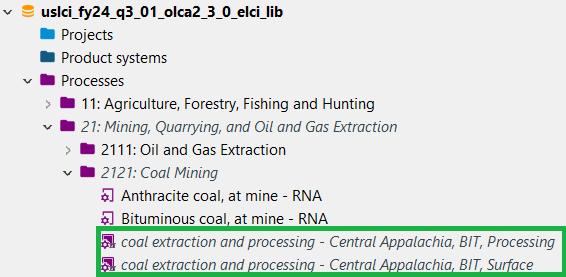

# openLCA Libraries User Guide
## What is a library?
The {term}`library` feature in openLCA 2.0 and later versions enables the use of databases together without needing to import them on top of one another. A library serves as a read only database that can easily be combined with other databases. Processes and other elements that are part of a library are not editable but can be utilized as part of processes or product systems in the foreground database.
Libraries are beneficial for the current set-up of the Federal LCA Commons (FLCAC) as they allow for multiple distributed repositories to be self-contained, while still promoting interoperability between repositories. The connections provided by libraries benefit multiple repositories on the FLCAC.
:::{note}
Libraries are currently an experimental feature in openLCA and may be updated based on user feedback.
:::

## Library Features

- When a library is included in a database, a new "Libraries" folder appears in the database navigation pane. Libraries are also stored in your openLCA navigation pane, outside of individual databases.

- Library elements are incorporated into your database, but these elements are differentiated from foreground database elements by appearing in grey italics. The processes in the green box below are examples of library elements.

- No elements in the library database can be altered.
- Library flows and processes can be used in processes in the foreground database.
- Flows and providers in the foreground database can be replaced by library flows and providers by using the openLCA flow mapping or bulk replace features.
- Product systems and results will include library processes and their product systems.

## Downloading a repository with a Library
When you download and import a repository that is connected to a library on the FLCAC you will be prompted to connect to the library as well. The url field should automatically populate with the library FLCAC url or you can choose to add a library from a file.

If downloading a {term}`JSON-LD` file with a library from another source, aside from the FLCAC, the library file must also be downloaded and referenced when importing into openLCA.  

## Creating a process or product system
To create a process with library flows, use the same process as when adding flows from your foreground database. The only difference is that flows and processes are indicated as library elements with these symbol:  .

Product systems also generate similarly with library processes. Ensure that library providers are connected in your model graph and check the results to ensure that they the library processes were included.

:::{attention}
Monte Carlo assessment is not currently available within databases that contain a library. 
:::

## Exporting a Library
To share a database the contains a library, the library must be exported and shared separately. To export a library, navigate to the "Libraries" folder in the foreground openLCA navigation pane, right click on the desired library, and select export.

## Importing a Library
To import a library into a foreground database, open the database by double clicking, right click the database name and select _"Add a library"_, then choose the desired library. The library can exist in the local version of openLCA or it can be imported from outside of openLCA.

:::{important}
If database elements (e.g., {term}`flows <flow>`, {term}`processes <process>`, etc.) overlap between the library and the foreground database, a **Data conflicts** popup may appear. This indicates that there is overlap between the foreground database and the library so the overlapping datasets in the foreground database are being updated with library datasets.

:::

The library should now be added to the foreground database. A "Libraries" folder will appear in the foreground database and the added library can be viewed. Library elements appear in this folder as well as in the foreground database. Library elements are italicized and show as a lighter shade than the foreground database elements.

:::{seealso}
[How to create a library](https://flcac-admin.github.io/FLCAC-docs/create-a-library#procedure)

:::
