This document provides detailed information on metadata fields for data on the FLCAC. Each field in this document corresponds to a field in openLCA.

As FLCAC interagency coordination increases, the new standard for data formats and documentation is being advanced. To move toward interoperability and transparency, FLCAC harmonization of digital data access and preservation will increase collaboration potential and the reviewability of the LCA data exchange process. These efforts will significantly reduce not only data acquisition costs but also computer- and human-based misinterpretation errors, and thus, data misuse. As such, and to be more aligned with international protocols for all newly developed data, **the current FLCAC standard is to strive for 100% metadata completion**.

The sections in this document correspond to the tabs[^exclusions] and sections within the openLCA software.

- [General Information](#general-information)
- [Inputs/Outputs](#input-output)
- [Documentation](#documentation)
- [Allocation](#allocation)

:::{important}
Each field has a description and example(s) recommended by the Data Curator for completing the metadata for processes submitted to the FLCAC. Some of these fields are mandatory, a few are automatically populated, and some are optional - this is noted next to the field name.
:::

:::{note}
It is preferred that data providers fill in their metadata directly in openLCA, but if needed an excel template can be provided to fill out metadata.
:::

[^exclusions]: Three openLCA process tabs are not included in this guidance 'Parameters', 'Social aspects', and 'Direct impacts'. Data providers do not need to provide any information on these tabs. Please discuss the use of parameters with the Data Curator if your data submission includes parameters.
___
# General Information
Key process level metadata are compiled on the General Information tab.

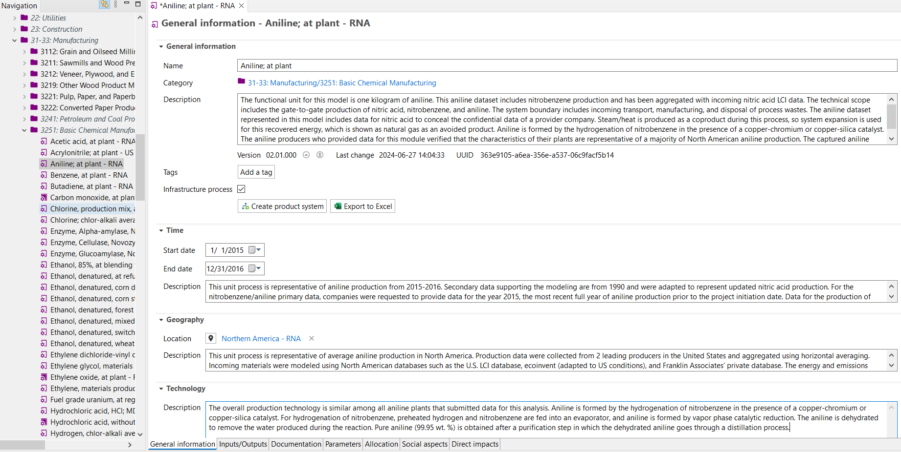
_**Image of ‘General Information’ process tab within openLCA**_

## **Name** (_Mandatory_)

- Process names are based on the [ILCD naming conventions, Section 3.2](https://eplca.jrc.ec.europa.eu/uploads/MANPROJ-PR-ILCD-Handbook-Nomenclature-and-other-conventions-first-edition-ISBN-fin-v1.0-E.pdf)
- Process name should reflect the product or service it represents
- The product reference output (i.e., quantitative reference flow) is given the same name as the process name excluding temporal or geographic references (i.e., those may be indicated by the provider process and/or in the quantitative reference flow metadata so that one quantitative reference flow may have several provider processes)

The naming conventions are as follows: 

**Base name[^mandatory]; treatment received[^mandatory], production route(s)[^mandatory], standard(s) fulfilled[^optional]; production or consumption type[^optional], location type[^optional]; quantitative flow properties**

[^mandatory]: Mandatory field
[^optional]: Mandatory field if relevant to the process. If not, it can be ignored.

For consistent nomenclature, use the following guidelines:

  - separate components with a semi-colon 
    - separate elements within a component with a comma
  - abbreviations and brackets should be avoided
  - chemical element symbols should be avoided (except in quantitative flow properties)
  - limit names to 220 characters

**Example(s)**
With 3 components:

- _Clinker; average mineral mix; at kiln; 1415 kg/m3_
- _Transport; long-haul truck, diesel powered; trip length > 200 mi_
- _Corn stover production; average, US, 2022; 15.5% moisture_

With 2 components:

- _Scanner manufacture; Kodak Alaris i940 desktop manufacturing process_

## **Category** _(Automatic)_

The category/subcategories schema follows North American Industry Classification System (NAICS). See [Categorization](DataSubmissionHandbook.md#naics-categorization) of the Data Submission Handbook for instructions on how to categorize flows and processes.

This field is automatically populated based on the folder that your process is located in.

**Example(s)**

- _22: Utilities/2211: Electric Power Generation, Transmission and Distribution_ 

- _31-33: Manufacturing/3253: Pesticide, Fertilizer, and Other Agricultural Chemical Manufacturing_

## **Description** _(Mandatory)_

A legible overview of the process description, i.e., technical scope, functional unit, system boundaries, and any other information needed for unambiguous data interpretation and application.

**Functional Unit**: The reference unit of your life cycle inventory that allows quantification of the defined function. It provides a reference to which the inputs and outputs can be related.

**Technical Scope**: Cradle-to-gate, cradle-to-grave, gate-to-gate, gate-to-grave.

**System boundaries**: Overview of included and excluded processes, i.e., boundaries between the technosphere and nature; geographic and temporal scope; boundaries between this and other technosphere systems. Be brief, detailed information on system boundaries can be provided in the [Sampling procedure](#sampling-procedure-mandatory) field.

:::{note}
Examples of included processes are: raw material acquisition; manufacturing/processing/refining; distribution/transport; production and use of fuels, electricity, and heat; use and maintenance of products; disposal of process waste and products; recovery of used products via reuse, recycling, and energy recovery; ancillary materials manufacturing; manufacture, installation, maintenance, and decommissioning of capital equipment; additional operations, such as lighting, heating, service personnel.
:::

**Other Relevant Information**: Include relevant modeling information regarding the inclusion of avoided products, co-products, cut-off flows, proxies, etc.

**Example(s)**

- _This gate-to-gate unit process is for the net production of one kilowatt-hour of electricity supply from a coal-fired plant with co-generation of steam in Four Corners Area, United States. The studied system includes all processes, from washed coal delivery through to power generation, including treatment of cooling water, of a combined heat and power plant with conventional steam cycle within a circulating fluidized bed. The fuel is 100% washed bituminous coal extracted from Rocky Mountain regional mines located within 500 km of the plant. Data are from one coal-powered base load plant so no aggregation was performed but is representative of typical coal-based power facility in that region._

- _The functional unit for this model is one kilogram of aniline. This aniline dataset includes nitrobenzene production and has been aggregated with incoming nitric acid LCI data. The technical scope includes the gate-to-gate production of nitric acid, nitrobenzene, and aniline. The system boundary includes incoming transport, manufacturing, and disposal of process wastes. The aniline dataset represented in this model includes data for nitric acid to conceal the confidential data of a provider company. Steam/heat is produced as a coproduct during this process, so system expansion is used to avoid allocation to recovered energy, which is shown as natural gas as an avoided product. Aniline is formed by the hydrogenation of nitrobenzene in the presence of a copper-chromium or copper-silica catalyst. The aniline producers who provided data for this module verified that the characteristics of their plants are representative of a majority of North American aniline production. The captured aniline production amount is approximately 71 percent of the aniline production in the U.S. in 2015._

## **Version** _(Automatic)_

Per ILCD, the data set version is formatted as follows: the first two digits indicate major updates, the second two digits refer to minor revisions and error corrections; the final three digits are used for automatic and internal version counting during dataset development.

 Unless discussed in advance with the Data Curator, the value will be generated automatically by openLCA.

**Example(s)**

_01.00.000_

## **Last change** _(Automatic)_

The date and time when the dataset was last saved.

**Example(s)**

_2018-04-01T17:38:55-0600_

## **UUID** _(Automatic)_

32-digit Universally Unique Identifier ({term}`UUID`) for the dataset.
Every element in an openLCA database has a UUID.
UUIDs cannot be set, they are assigned by openLCA.

**Example(s)**

_961fad56-bde2-4fbe-8895-5be03461729b_

## **Infrastructure** _(Mandatory)_

Checking the box indicates that the process accounts for infrastructure requirements in its inventory. Leave this box unchecked if infrastructure requirements are not included in the process.
More information on the inlcusion of infrastructure should be described in the [System Boundaries](#description-mandatory).

**Example(s)**

## **Time** _(Mandatory)_

**Start Date**

Start date for the time period that the process data represents. The date format is MM/DD/YYYY.

**Example(s)**

_01/01/2017_

**End Date**

End date for the time period that the process data represents. The date format is MM/DD/YYYY.

**Example(s)**

_12/31/2017_

:::{important}
The Start and End Date fields should not represent publication dates, they should represent the period for which the process data is representative. 
:::
:::{note}
The time span is often the same as the foreground data collection period. If data has been gathered from secondary sources, reference those sources to find primary data collection dates and report the earliest and latest dates and include detail in the description field below.
:::

**Description**

Provide information regarding the temporal characteristics and period that the process data represents. Information can also be provided pertaining to secondary data source time periods.

Examples can include explanation of the valid time period, any temporal aggregation (e.g., averaging multiple years of primary data), data collection period, and seasonal/annual variations.

:::{note}
The valid time span is often identical to the time of the data collection, unless projections or other forecasts have been applied. Limitations on the validity in valid time span can include future technology shifts, planned measurement improvements, or specific seasons.
:::

**Example(s)**

- _This unit process is representative of operations from 2014-2015. Water consumption varied seasonally but was averaged over an annual period._
- _This unit process is representative of aniline production from 2015-2016. Secondary data supporting the modeling are from 1990 and were adapted to represent updated nitric acid production. Companies providing primary data were given the option to collect data from the year preceding or following 2015 if either year would reflect more typical production conditions. One company provided data for the year 2015, and one company provided data for the year 2016. After reviewing individual company data in comparison to the average, each manufacturer verified data from 2015-2016 was representative of an average year for aniline production at their company._ 

## **Geography** _(Mandatory)_
**Location**

The geographic area to which the unit process data were collected or refer. If multiple locations were used, indicate the location using the lowest common geographic resolution (e.g., if data for several states across the US were collected then enter 'US').
Describe the locations in the geography 'Description' field.

**Example(s)**
- _US-CO_
- _RNA_ 

:::{important}
If the location for your process does not currently exist in the USLCI, the Data Curator can generate it for you.
:::

**Description**

Description of the process' geographic representativeness and any geographic aggregation methods as well as name(s) and production volume(s) or capacity of specific included site(s), where applicable.

**Example(s)**

- _This process is representative of production in the state of Colorado. Production data were aggregated across five sites ranging from eastern to western Colorado._
- _This unit process is representative of average aniline production in North America. Production data were collected from 2 leading producers in the United States and aggregated using horizontal averaging. The energy and emissions data for nitric acid production is from a primary European source from 1990 and was adapted to North American conditions._

## **Technology** _(Mandatory)_

A short (i.e., 1-3 paragraphs), general description of the process intended technical scope, representativeness, and applicability of the process. Include the following information, as applicable:

- Process design including sub-processes, unit operations, and/or other activities (anthropogenic or natural) included in the process
- Material selection and quality
- Operational conditions and representativeness
- A description of any waste and/or transport modeling

**Example(s)**

- _This process represents the production of "Calcium carbonate, ground, 20 microns, at plant" using average technologies for the United States from 2015-2016._ 

  _The process includes three sub-processes: Quarry Operations; Transport and Plant Processing. Quarry Operations includes the following unit operations: mechanical extraction; primary crushing; screening; and intermediate storage of calcium carbonate rock (marble, limestone, or chalk). Transport includes the transport of materials from Quarry Operations to Plant Processing via barge, train, or truck. Plant processing which includes jaw crushing, washing, impact crushing, ball milling to particle size, and then classifying. Material selection and quality represent industry averages from the contiguous United States. Operational conditions represent industry averages from the contiguous United States. Fate and transport modeling was not considered for this process._
- _The overall production technology is similar among all aniline plants that submitted data for this analysis. Aniline is formed by the hydrogenation of nitrobenzene in the presence of a copper-chromium or copper-silica catalyst. For hydrogenation of nitrobenzene, preheated hydrogen and nitrobenzene are fed into an evaporator, and aniline is formed by vapor phase catalytic reduction. The aniline is dehydrated to remove the water produced during the reaction. Pure aniline (99.95 wt. %) is obtained after a purification step in which the dehydrated aniline goes through a distillation process._

## **Data Quality**
### **Process Schema** _(Mandatory)_
#### Matrix
Use the US EPA - Process Pedigree Matrix, this matrix comes preloaded in many FLCAC repositories. This matrix can also be found in the [Commons Core Database](https://www.lcacommons.gov/lca-collaboration/Federal_LCA_Commons/Fed_Commons_core_database/datasets) which can be imported as a skeleton structure into any openLCA database.

#### Data Quality Entry
Once you have selected the US EPA - Process Pedigree Matrix, select '(not specified)' next to the 'Data quality entry' field and select the appropriate data quality scores for the 'Process Review' and 'Process Completeness' fields.

Please reference [EPA's Guidance on Data Quality Assessment for Life Cycle Inventory Data](https://cfpub.epa.gov/si/si_public_record_report.cfm?Lab=NRMRL&dirEntryId=321834) for information about the development of this matrix and guidance on how to complete it.

**Example(s)**

### **Flow Schema** _(Optional)_
:::{important}
While it is highly recommended to complete flow level data quality for data submissions, it is currently not mandatory.
Please consider completing for level data quality for the most important flows.
:::

#### Matrix
Use the US EPA - Flow Pedigree Matrix, this matrix comes preloaded in many FLCAC repositories. This matrix can also be found in the [Commons Core Database](https://www.lcacommons.gov/lca-collaboration/Federal_LCA_Commons/Fed_Commons_core_database/datasets) which can be imported as a skeleton structure into any openLCA database.

#### Data Quality Entry
Select the US EPA - Flow Pedigree Matrix on the 'General Information' tab and enter data quality scores for each {term}`exchange` in the inventory on the 'Inputs/Outputs' tab.

Please reference [EPA's Guidance on Data Quality Assessment for Life Cycle Inventory Data](https://cfpub.epa.gov/si/si_public_record_report.cfm?Lab=NRMRL&dirEntryId=321834) for information about the development of this matrix and guidance on how to complete it.

Detail any assumptions used to assign these scores in the [Data treatment](#data-treatment-mandatory) field.

**Example(s)**

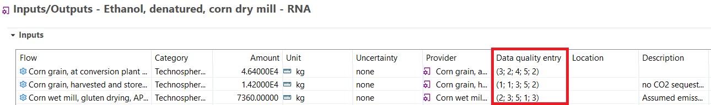

### **Social Schema** _(Optional)_
The FLCAC does not require social schema.
___
# Input/Output

The Inputs/Outputs tab is where the life cycle inventory of the process is defined. It can include data on Elementary Flows, Technosphere Flows, and/or Waste Flows.

_**Image of 'Inputs/Outputs' process tab within openLCA**_

## **Flow** (_Mandatory_)
{term}`Elementary Flows <elementary flow>`: Should only be from the {term}`FEDEFL <Federal Elementary Flow List>`.

**Example(s)**
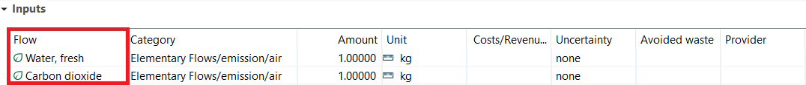

:::{tip}
To ensure that elementary flows included in a process are FEDEFL flows, open up the flow information by double clicking a flow and check the description field. The description will include a statement such as this "From FedElemFlowList_1.0.1. Flow Class: Chemicals. Not a preferred flow." if it is a FEDEFL flow.
:::

{term}`Technosphere Flows <technosphere flow>`: Flows should be based on the [ILCD naming convention](#name-mandatory). Read about technosphere flow alignment on the FLCAC [here](DataSubmissionHandbook#technosphere-flow-alignment).

**Example(s)**
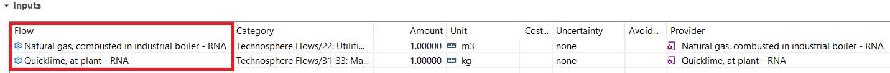

Quantitative Reference Flow: The quantitative reference flow is the designated output of a process. The quantitative reference flow is bolded and can be in the inputs or outputs section depending on the process type. A {term}`process` must have a quantitative reference flow to be created.

**Example(s)**
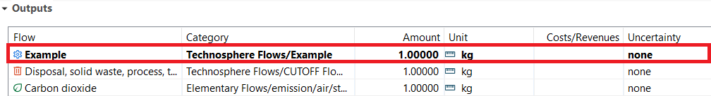

## **Category** (_Automatic_)
Category is determined based on the folder that the flow is contained within. The FLCAC uses NAICS Categories to organize flows and processes, read about FLCAC Categorization [here](DataSubmissionHandbook.md#naics-categorization).

**Example(s)**
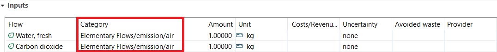
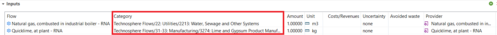

:::{tip}

- Drag and drop flows and processes into different folders to change the flow category.
- Create a new folder by right clicking an existing folder and selecting "Add a new child category".
- The [Federal LCA Commons Core Database](https://www.lcacommons.gov/lca-collaboration/Federal_LCA_Commons/Fed_Commons_core_database/datasets) contains the skeleton NAICS structure, this can be imported into an existing openLCA database.
:::

## **Amount** (_Mandatory_)
Flow quantity

**Example(s)**
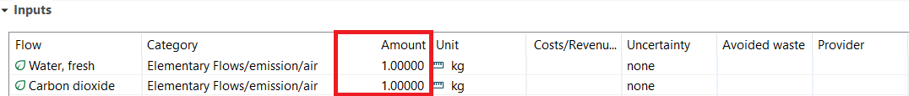

## **Unit** (_Mandatory_)
Flow unit; the openLCA software includes a set of unit groups and units. These units must be used to ensure proper data importation. 

:::{note}
If the pre-existing units in a database are not appropriate for one or more of your dataset flows, contact the Data Curator and they will assist in adding a unit to the list.
:::

**Example(s)**
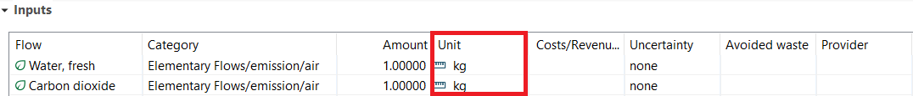

## **Costs/Revenues** (_Optional_)
This field is provided for documenting life cycle costing (LCC) data. The currency and costs may be provided for each flow; the costs per unit are automatically generated based on this information and flow amount.

This field is not required and should be left blank if no life cycle costing data is available.
Most LCI data on the FLCAC does not include life cycle costing data.

**Example(s)**
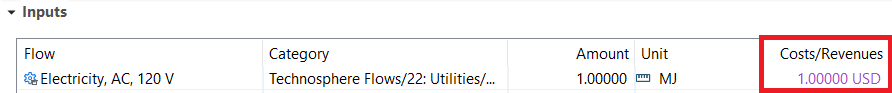

## **Uncertainty** (_Optional_)
Describe flow's data uncertainty. The distribution type, mean, and standard deviation may be provided.
This information, while not required, if encouraged.
Details on the available uncertainty options can be found in the [openLCA manual](https://greendelta.github.io/openLCA2-manual/advanced_top/monte_carlo.html#adding-uncertainty-information).
Uncertainty data are only used when performing a [Monte Carlo analysis](https://greendelta.github.io/openLCA2-manual/advanced_top/monte_carlo.html).

**Example(s)**
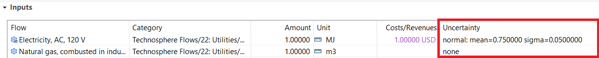

## **Inputs: Avoided Waste** (_Optional_)
If there is a scrap or waste flow that is utilized in your process, the flow may be listed as an input to your dataset and marked as an avoided waste.

## **Outputs: Avoided product** (_Optional_)
Used to indicate allocation has been avoided in a multi-functional process. This box should only be checked for the by-product flow(s). For example, if a process produces steam and offsets natural gas, then natural gas would be entered as an output flow and the avoided product box would be checked. 

:::{important}
The provider should always be chosen if a flow is an avoided product.
:::

**Example(s)**

## **Provider** (_Mandatory_)
For every non-{term}`cutoff <cut-off flow>` technosphere flow, a provider must be selected. A {term}`provider` connects the flow to an upstream process producing that flow. Every non-cutoff technosphere flow should have at least one provider option.

:::{note}
Only non-cutoff technosphere flows have an upstream provider. Cutoff flows and elementary flows do not have providers as they are not being produced by a process.
:::

**Example(s)**
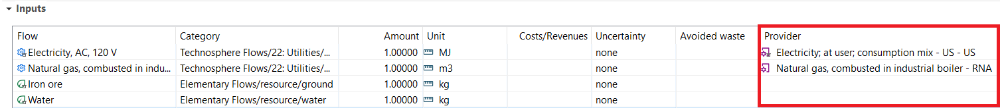

## **Data quality entry** (_Optional_)
[See the flow data quality section](#flow-schema-optional).

This information is not required, but if provided it increases the usefulness of a process.

## **Location** (_Optional_)
Flow level locations can be provided if the location for a specific flow level exchange **differs** from the [process location](#geography-mandatory).

:::{important}
To better support regionalized impact assessment, USLCI and FLCAC repositories will no longer allow locations on flow objects, but instead will utilize locations on {term}`exchanges <exchange>` and/or {term}`processes <process>`
:::

**Example(s)**
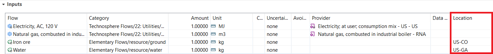

:::{note}
In the example above, the location has not been entered for the first two technosphere flows. For these flows, the flow exchange location does not differ from the process location (US and RNA), and so a flow exchange location is not needed.
:::

## **Description** (_Optional_)
Briefly describe the flow's relationship to the process and assumptions used to obtain the quantitative reference or data quality.

Types of information to include in the flow description field:

- Conversion factors
- Proxy/surrogate information (e.g., this flow is a proxy for the original flow "Natural gas combustion, RoW" from the ecoinvent database v2.1)
- Aggregation methods (e.g., two natural gas flows existed in the original study, these have been combined into one value)
- Stage of the LCI that a flow relates to (e.g., transportation from plant to warehouse)
- Other details about how the flow was transformed from the original study
- Pertinent information related to a specific flow that would impact the use of the data

**Example(s)**

___
# Documentation
The Documentation tab provides additional process level metadata.

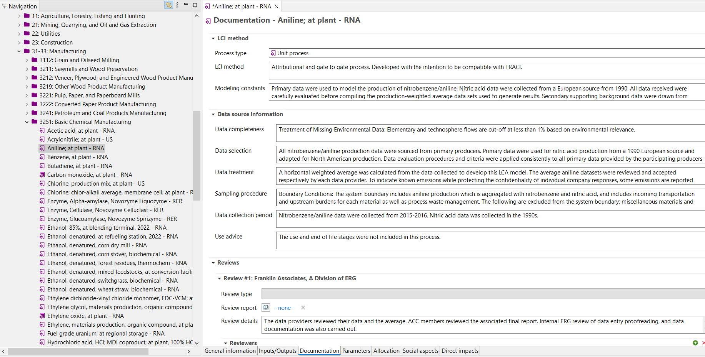
_**Image of 'Documentation' process tab within openLCA**_

## LCI Method

### **Process type** (_Mandatory_)
Indicate whether the data represent a unit or system process.

**Example(s)**

- _{term}`Unit process <unit process>`_
- _{term}`System process <system process>`_

### **LCI method** (_Mandatory_)
Indicate whether the LCI method was attributional, consequential, input/output, hybrid, etc. Can include caveats regarding inclusion of the process in a product system.

**Example(s)**

- _Attributional process. Represents gate-to-gate data, use and end-of-life is dependent on how the product is used._
- _Consequential process_

### **Modeling constants** (_Mandatory_)
State the primary assumptions used to create this process. Detail how the process differs from the original source.

:::{important}
Sources cited throughout metadata fields should also be added as sources in openLCA. See [Sources](#sources-mandatory) for instructions on how to create a new source in openLCA.
:::

**Example(s)**

_This process was adapted from a Smith, 2016 process for wood pellet manufacturing for pellets of a specific energy value in Europe. Process weight factors were adapted for the energy density of a typical US biomass fuel._

## Data source information

### **Data completeness** (_Mandatory_)
This field is comprised of three elements:

1. Treatment of Missing Environmental Data:
List and describe accounting methods for missing environmental data (e.g., cut-off rules) and/or intentional environmental data omissions.

2. Treatment of Missing Technosphere Data:
List and describe accounting methods for missing technosphere data and/or intentional technosphere data omissions.

3. Mass Balance:
Either quantify and describe the mass imbalance ((mass of material outputs - mass of material inputs)/mass of material outputs) or state, "The mass balance for this process was not calculated."

**Example(s)**

_Elementary flows are cut-off at less than 1% based on environmental relevance. Technosphere flows are cut-off at less than 1% based on environmental relevance. The mass imbalance for this unit process is -17.87 kg (-0.72%)._

### **Data selection** (_Mandatory_)
Detail how data was selected for this process. If data was excluded, explain why.

**Example(s)**

- _Data was collected from 5 primary producers, one producer's data was not used because it was not representative of standard production practices._
- _Source 1 disaggregated waste inputs and listed heating values and emission factors for the incineration. Whereas, Source 2 had only heating values for waste flow inputs. Therefore, Source 2 waste heating values were excluded from the averages._

### **Data treatment** (_Mandatory_)
This field consists of two sections:

1. Detailed description of the methods and assumptions used to transform primary and secondary data into flow quantities through recalculating, reformatting, aggregation, or proxy data. 

:::{important}
The data documentor shall ensure that all data related to the relevant process in the unformatted document that are of environmental importance are adequately transferred and that no bias is generated. Justification and documentation shall be made regarding information that has been neglected or modified. 
:::

:::{note} Aggregation Types

Horizontal averaging combines data from processes serving the same function, e.g., via a production volume-weighted average.

Vertical averaging sums several interconnected processes to protect identification of the contribution of individual steps or entities, a.k.a., “gate-to-gate aggregation”.
:::

2. Describe any assumptions that were used when assigning [data quality](#data-quality) scores.

**Example(s)**

_A horizontally weighted average was calculated from the primary data collected from 4 producers. To indicate known emissions while protecting the confidentiality of individual company responses, some emissions are reported only by the order of magnitude of the average. Flow level data quality scores assume that the reference year is 2024._

### **Sampling procedure** (_Mandatory_)
This field is comprised of three elements:

1. System Boundary Conditions: A description of what is included and excluded from the system boundaries.

2. Data collection: A description of how data were collected for this process.

3. A description of if and how uncertainty was calculated for this process. If uncertainty was not calculated, this should be explicitly stated.

**Example(s)**

- _The system boundary is gate-to-gate and includes incoming transportation, direct emissions, material and energy use, as well as process waste management. The following are excluded from the system boundary: miscellaneous materials and additives, capital equipment, facilities and infrastructure, and support personnel requirements. Data were collected directly from 4 aniline manufacturers. Uncertainty was not calculated._
- _The system boundary includes: 1) the transport of raw materials to multiple manufacturing facilities where various subcomponents are produced; 2) the manufacture of subcomponents; 3) the transport of subcomponents to a different manufacturing plant for final assembly; 4) the assembly of subcomponents into a complete scanner; and 5) the transport of generated waste from the manufacturing facilities to a municipal solid waste landfill. The following processes and life cycle phases fall outside the system boundary: 1) packaging of the completed scanner; 2) all transport downstream of the assembly plant gate; 3) sale of product; 4) product use phase; and 5) end-of-life phase (including recycling)._

  _For material inputs, data collection was based on scanner specifications provided by the manufacturer. Other inputs (e.g. energy; waste transport and disposal) were calculated on the basis of quantity of input per kg of scanner produced._

  _Uncertainty was estimated based on engineering judgment. Material inputs had less uncertainty because they were based off of precise engineering specifications. Other inputs (e.g. energy; waste transport and disposal) had more uncertainty._

### **Data collection period** (_Optional_)
Include any additional information regarding data collection time period that was not covered in the [Time](#time-mandatory) field.

**Example(s)**

_All primary data were collected from 2015 to 2016. Secondary data were collected from 2005-2016 (NREL 2016; Wernet et al. 2016)._

### **Use advice** (_Optional_)
Detail information that a data user needs to be aware of when using this process.

This field is highly recommended if use advice is applicable to a process.

**Example(s)**

- _This process does not contain use or end-of-life stage because these vary based on the intended use of a product._
- _Cut-off flows were used for waste products which causes toxicity results to be underestimated by 20%._

## Reviews

### **Review type** (_Mandatory_)
Choose the appropriate review type from the dropdown menu in openLCA. Options: dependent internal review, independent internal review, independent external review, accredited third party review, independent review panel, not reviewed.

:::{note} Adding a New Review Entry
To add a new review entry, select the green plus in the upper right hand corner of the 'Reviews' section. Every process should have at least one review entry.
:::

### **Review report** (_Optional_)
If a review report is available, then reference that report in this field using a source object. If there are relevant details regarding the review in another source, cite that source and the section of the source where review details can be found in the [Review details field](#review-details).

See the [Sources section](#sources-mandatory) for details on how to add a source into openLCA.

### **Review details** (_Optional_)
Note any relevant details regarding the review here, such as which section in the referenced source can the review details be found.

**Example(s)**

:::{note} Additional Review Fields
There are multiple additional fields under the Reviews section that are not currently required to be completed. (Reviewers, Review methods, Quality assessment, Compliance declarations, and Completeness)
:::

-->
## **Sources** (_Mandatory_)
Reference to the publication or entity from which data or methodology were obtained. Also include any other sources referenced throughout the metadata. Do not include full citations in other metadata fields, but rather use a shortened citation `(Smith, 2024)` and include the full citation as an openLCA source.

The field is populated from the list of Source objects in the openLCA navigation tree.

New sources should use "Author (YEAR) Abbreviated Title" format for the Name such that these information display in the openLCA navigation panel.

:::{admonition} Adding a New Source
To add a new source:

1. Open the 'Background data' folder in the openLCA navigation pane of database
2. Right click the 'Sources' folder and select 'New source'
3. Enter the metadata:
    - Name: "Author (YEAR) Abbreviated Title"
    - Description: Details about the source (if needed)
    - URL (if available)
    - Text reference: Full source title
    - Year
:::

**Example(s)**
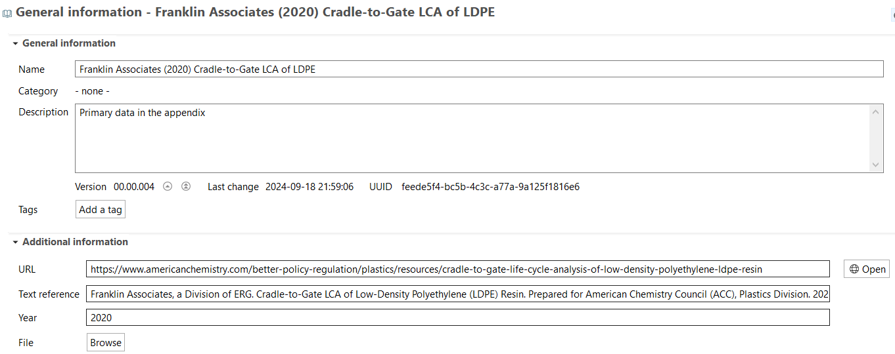

## Administrative Information

### **Project** (_Optional_)
Information about the project in which the data were generated. Where applicable, this field should indicate the project name, funding institution(s) or organization(s), and the grant or contract names and numbers.

This field is not required if this information is not available.

**Example(s)**
_This project was supported by the Biomass Research and Development Initiative, grant no. 2011-10006-30357 from the USDA National Institute of Food and Agriculture._

### **Intended Application** (_Mandatory_)
This field consists of 5 elements:

1. Use one of the four Main Goal Situations below to describe how the process is intended to be used. The term, "Main Goal Situations," refers to an LCA study's primary intended purpose per the ILCD Handbook’s Detailed Guidance. 

:::{admonition} Main Goal Situations
:class: dropdown
SITUATION A -- MICRO-LEVEL DECISION SUPPORT
The intended application for this process is for micro-level decision support as described in Goal Situation A from the ILCD Handbook's Detailed Guidance. LCA studies with this intended application are often used to answer product-related questions. Decisions stemming from these LCA studies "are assumed to have only limited or no structural consequences outside the decision-context,...do not change available production capacity...[and do not cause] large-scale consequences in the background system or other parts of the technosphere[.]"

SITUATION B -- MESO/MACRO-LEVEL DECISION SUPPORT
The intended application for this process is for meso/macro-level decision support as described in Goal Situation B from the ILCD Handbook's Detailed Guidance. LCA studies with this intended application are often used to support strategic level decisions such as "raw materials strategies, technology scenarios, policy options, etc. [Such decisions] are assumed to [result in] large-scale consequences in the background system or other parts of the technosphere."

SITUATION C1 -- ACCOUNTING
The intended application for this process is for accounting purposes as described in Goal Situation C1 from the ILCD Handbook's Detailed Guidance. LCA studies with this intended application offer "purely descriptive documentation of the system under analysis (e.g., a product, sector or country), without being interested in any potential consequences on other parts of the economy.” The studies categorized under Goal Situation C1 do consider existing benefits outside the analyzed system such as recycling.

SITUATION C2 -- ACCOUNTING
Same as in SITUATION C1 except LCA studies categorized under Goal Situation C2 do NOT consider existing benefits outside the analyzed system such as recycling.
:::

2. Target audience and the context for which the model was built (e.g., carbon footprint, Environmental Product Declaration (EPD), policy development, policy information, generic unit process data, etc.).
3. Indicate the completeness level of the elementary flows such that users can interpret the correct application of LCIA methods to the dataset. If the data were originally developed and analyzed with a LCIA method, indicate the method utilized here. 
4. If these data are an update to a previously published dataset, a note should be included here.
5. Any additional details regarding the intended application/use of this process.

**Example(s)**

_Situation C1 - Accounting, with system-external interactions - The intended application is a purely descriptive accounting / documentation of the analysed system including existing interactions with other systems in the LCI model._

_The target audience of this model includes LCA practitioners, industry, and the general public. A full inventory of environmental flows are included; thus this unit process can be used for a full range of LCIA impact categories. The original study results were analyzed using the TRACI LCIA factors. These data are an update to the previously published dataset from 2010._ 

_These data are intended to be used as an average dataset accepted by the North American plastics/chemical industry._

### **Data set owner** (_Mandatory_)
Name of the person or entity that owns the dataset directly from which the process was generated. The data set owner is often the data commissioner. 

### **Data generator** (_Mandatory_)
Name of the person or entity responsible for generating the dataset from which the process was generated or for updating of the data. 

### **Data documentor** (_Mandatory_)
Name of the individual or entity responsible for formatting and submitting the data.

These fields are populated from the list of Actors in the openLCA navigation tree.

:::{admonition} Adding a New Actor
To add a new actor:

1. Open the 'Background data' folder in the openLCA navigation pane of database
2. Open the 'Actors' folder 
3. There are two subfolders: 'Organizations" and "Persons", right click on the appropriate one and select 'New actor'
3. Enter the metadata:
    - Name
    - Description: Details about the actor (if needed)
    - Additional information (not required, but recommended to add some contact information)

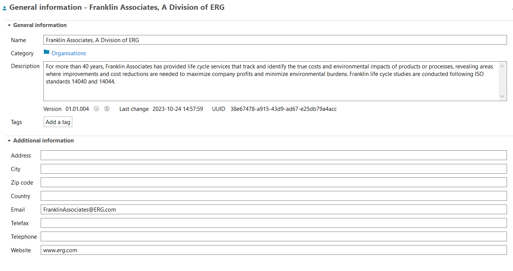
:::

**Example(s)**

### **Publication** (_Mandatory_)
Reference to an openLCA Source that illustrates how the processes' LCI data were developed and/or used, i.e., a foundational publication that illustrates how the data are used.
The field is populated from the list of Sources in the openLCA navigation tree. Follow the instructions in the [Sources](#sources-mandatory) section to create a new source.

**Example(s)**

### **Creation date** _(Automatic)_
The date and time when the dataset was created. This field will be automatically generated.

**Example(s)**

_6/1/18 12:45 PM_

### **Copyright**
The openLCA software has a checkbox that will indicate whether the dataset is copyrighted. This box should remain unchecked.

**Example(s)**

### **Access and use restrictions**
For USLCI datasets please copy and paste the Data Use Disclaimer Agreement found [here](https://github.com/FLCAC-admin/uslci-content/blob/dev/docs/submission_handbook/04-resources/04-App-A.md) into this field. 

For other FLCAC repositories, please contact the repository owner for repository specific guidance on this field.

___
# Allocation
This tab allows for customization of allocation for multi product processes. Details on allocation approaches are described in the [openLCA manual](https://greendelta.github.io/openLCA2-manual/allocation.html)

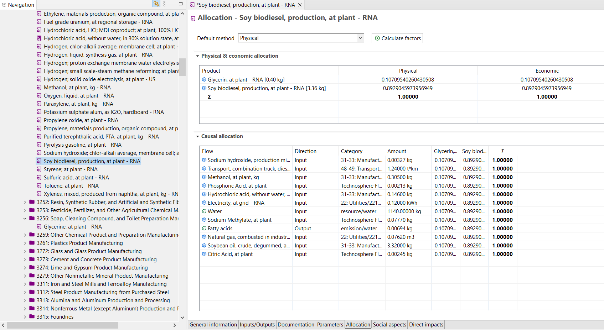
_**Image of 'Allocation' process tab within openLCA**_

## **Default Method** (_Mandatory_)
For multi-functional processes, choose the process allocation method: causal, economic, or physical allocation methods.

## **Physical and Economic allocation** (_Automatic_)
The reference flow is listed first by default. The primary product and co-products must have the same flow property.

Physical allocation factors are based on the physical (e.g., mass or energy) ratio of the product flows.
Economic allocation factors are based on the economic value of the product flows. 

The ratio for the product will be 1.0 for a single-output process. For multi-output processes, the ‘Calculate default values’ button will automatically calculate the ratios based on the default (reference) flow property.
Economic flow properties or [cost](#costs-revenues-optional) must be included to automatically calculate economic allocation factors.

## **Causal allocation**
Allocation factors can be set by the data provider for individual flows based on a methodology described in the metadata.
