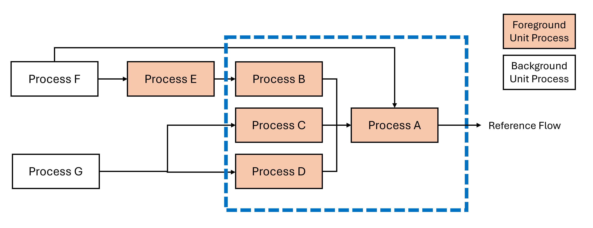
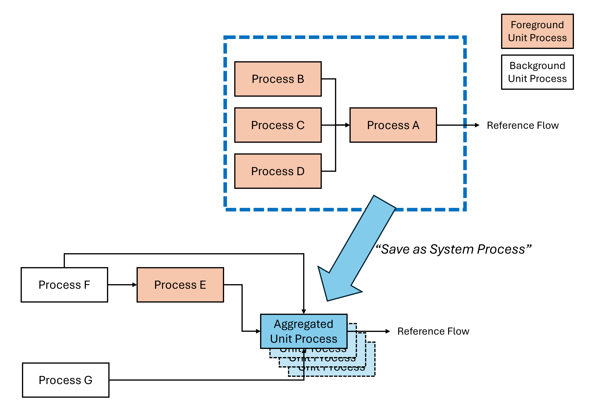

In LCA modeling, it can be common for practitioners to build highly resolved and parameterized models.
These models may allow the generation of LCA results that are spatially explicity (i.e., regionalized) or that reflect specific scenario modeling, often through the use of global parameters.
However the use of parameters in LCA models can be cumbersome when they are intended as background or secondary data.
This document describes an approach for generating **aggregated unit processes** in openLCA for use as background data from complex models.
These unit processes are similar to {term}`system processes <system process>`, except they maintain transparent links to background data.

:::{tip} Example
For example, NETL's LCA model for [Coal extraction and delivery](https://doi.org/10.2172/2370100) is parameterized to allow users to choose a combination of coal types (e.g., bituminous or sub-bituminous), mine types (surface or underground), and coal basins (e.g., Powder River Basin). However because the model is based on a single set of parameterized unit processes, using coal in the background from multiple sources simultaneously is not possible without further adjustments.
:::

## Approach

1. Generate a product system of your model that is appropriately parameterized for your scenario.
2. Using the openLCA model graph, remove links to background data that are unparameterized. All processes that are impacted by the selection of a global parameter value must remain in the product system - these are the unit processes that will be aggregated.

:::{hint}
As an alternative to steps 1 & 2, navigate to the unit processes and remove the appropriate default providers for those data you do not want to include. Then create a product system and select "only include default providers".
:::

3. Generate inventory results for this product system.
4. Save those results "As a system process" in openLCA. This will create a new process in openLCA that should have a number of input and output flows. Any technosphere flows that were unlinked in the step above will be maintained as technosphere flows without default providers.
5. For metadata purposes, this process can be indicated as a "Unit Process" in the [process type field](../MetadataGuidance.md#process-type-mandatory).
6. In this new aggregated unit process, apply default providers for any technosphere flows that remain.
7. Repeat this process as needed for other scenarios.

In the diagram below, processes A through E reflect core or novel modeling performed in an LCA model.
Processes A, B, C, and D are parameterized using a global parameter to reflect specific scenarios or regions.
Process E is not impacted by the global parameter.
Processes F and G represent background data (e.g., fuels, materials, or transport which are not core data), which may not be included in the final repository.

To create the aggregated unit process, all links are removed to processes which will not be aggregated (and which are not impacted by the global parameter).
Results are run for the resulting product system and they are "Saved as System Process".
This can be repeated as many times as necessary for the relevant parameterized scenarios.

## Limitations

- Aggregated unit processes will not maintain any uncertainty information from the original model (see [Uncertainty](#uncertainty)).
- Metadata will need to be re-compiled for the aggregated unit process.
- Aggregated unit processes are not intended to reproduce reported results. For example, background data may be updated.

## Uncertainty

While uncertainty estimates on individual data points are not maintained in this approach, Monte Carlo analysis can be used to estimate and re-apply a distribution to exchanges in the resulting aggregated unit process. 

## Examples

- [Coal Extraction repository](https://www.lcacommons.gov/lca-collaboration/National_Energy_Technology_Lab/Coal_extraction/datasets), which is based on the [NETL Coal Baseline LCA model](https://doi.org/10.18141/2560300).
