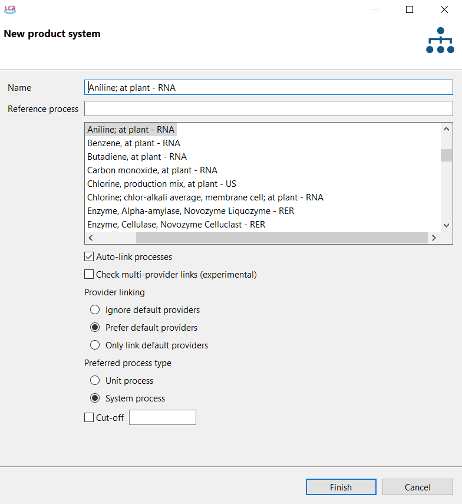

## Running Calculations on a FLCAC Repository in openLCA
Recommended workflow for a basic calculation:
1. Import methods that are aligned with FEDEFL into your database
:::{note}
Read more about available methods and where to access them [here](https://flcac-admin.github.io/FLCAC-docs/lciamethods)
:::
2. Select the process that you would like to calculate results for
3. On the 'General Information' tab of a process, select 'Create Product System'
4. The default product system settings work well for running a basic calculation
{.bg-warning w=100px align=center}
:::{note}
Read more about these settings [here](https://greendelta.github.io/openLCA2-manual/prod_sys/Creating.html)
:::
5. Check the 'Reference' section of your product system - the product, unit, amount chosen here are the functional unit of your product system/what your results will be calculated on
6. Check the 'Model graph' tab, to ensure that your product system is complete 
:::{note}
Read more about the model graph [here](https://greendelta.github.io/openLCA2-manual/prod_sys/model_graph.html)
:::
7. Select 'Calculate' on the 'General information' tab of your product system
8. Use 'As Defined in Process' as the Default Allocation Method[^allocation_note]
9. Select an Impact Assessment Method, if none are available in the drop down then you do not have LCIA methods in your database and review Step 1 above
10. Choose either 'Lazy/On-demand' or 'Eager/All' - the results will be the same, regardless of which option you choose
{.bg-warning w=100px align=center}
:::{note}
Read more about these calculation methods [here](https://greendelta.github.io/openLCA2-manual/res_analysis/lazy_eager.html)
:::
:::{note}
And read more about the calculation properties' settings [here](https://greendelta.github.io/openLCA2-manual/res_analysis/index.html)
:::
11. Select 'Finish' and view your results
:::{note}
Read more about each openLCA Results tab [here](https://greendelta.github.io/openLCA2-manual/res_analysis/analysis.html)
:::
    

[^allocation_note]:
    - Using _NONE_ or _CAUSAL_ as the default allocation method, as designated by data providers in many USLCI multi-output processes, can produce unexpected LCI and LCIA results.
    - The _PHYSICAL_ and _ECONOMIC_ default methods produce expected results.
    - For more information, please see [this double-counting thread on allocation](https://ask.openlca.org/2281/allocation-in-multifunctional-processes) and this [unit properties in allocation thread](https://github.com/GreenDelta/olca-app/issues/83).